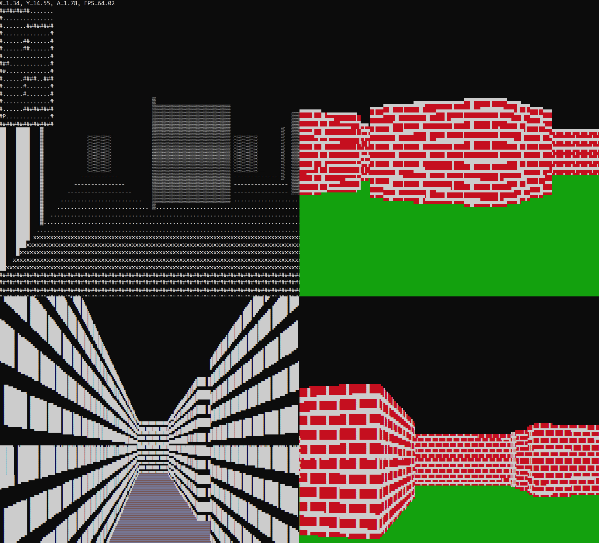

# Ray Casting Algorithm

**Gallary**



### Introduction

Ray Casting is a lightweight technique for 3D graphical rendering that when implemented correctly creates a compelling illusion of an explorable 3d space. This project explores the concepts of ray casting and allows the user to use various methods of rendering the environment. 

### Usage

This codebase is built to run on Windows computers and the virtual environment requires python 3.7 to be installed.

The following files:
Ray_Casting_Classic.py
Ray_Casting_Textured.py
Ray_Casting_Hashed.py
Ray_Casting_Hashed_color.py

Are all created to demonstrate different rendering methods of the Simulation Class within the repo. All rendering methods are built on top of the same ray casting algorithm. To test each method the associated file can be run directly.

There are limitations that should be noted:
All fills use ASCII characters from the extended set and may not be available with all command prompts
The Simulation Class uses colors when rendering text that not all command prompts support
Ray Casting Hashed and Ray Casting Hashed Color require JSON files of a pre-hashed map of the 3d environment. The user can create these files with the Make_Hashed_Map.py file. Alternatively, several of these pre-hashed files can be downloaded below as they are too large to store on GitHub and each requires at least 8 gigabytes of memory to run. Save these files in an extracted state in the hashed_map directory of this repo.


**Creating Maps**

Users can create maps that can be rendered with any of the above-listed methods. Maps exist as 2-dimensional arrays and consist of one ‘p’ ASCII character as well as a mix of ‘#’ characters representing walls and ‘.’ characters representing empty space.

An example of a constructed map:
```

map_two = []
map_two.append(list('################'))
map_two.append(list('#.#.....p......#'))
map_two.append(list('#.#............#'))
map_two.append(list('#.#............#'))
map_two.append(list('#.#............#'))
map_two.append(list('#..............#'))
map_two.append(list('#.#.....#....###'))
map_two.append(list('#.#.....#......#'))
map_two.append(list('#.#.....#....###'))
map_two.append(list('#.#.....#......#'))
map_two.append(list('#.##....#......#'))
map_two.append(list('#...#.......####'))
map_two.append(list('#.##...........#'))
map_two.append(list('#.#.........#..#'))
map_two.append(list('#...........#..#'))
map_two.append(list('################'))

```

Player spawns in at the location of p facing the southern direction.

**Hashing Maps**

Once a map is constructed the maps can be hashed by running the Make_Hashed_Map.py file and specifying which map to be hashed. Depending on the size of the map hashing can take 30 minutes to several hours. Several maps have been pre-hashed and saved to a personal google drive account.

Map One Hashed Download [Here](https://drive.google.com/file/d/1Ws2Q2WXOJVLGt2i_gu-BLtg3crU63zSK/view?usp=sharing)

Map Two Hashed Download [Here](https://drive.google.com/file/d/1BNAjFWH12K9ixtiiuNjB-0_zz1oh_Mxe/view?usp=sharing)

**Creating Sprites**

Sprite textures can be used to change the textures of the wall in the simulation. There is currently a designed brick wall texture. New textures can be created by making a 2-dimensional array of strings representing color information (It should be noted that structure has not yet been built in this repo to make new sprite creation user-friendly). The Simulation Class is currently wired to handle red and white colors. However, manual manipulation of these colors can be changed in the files. Please reference the [python-curses](https://docs.python.org/3/howto/curses.html) documentation for more information on coloring text in the command prompt.

**Executables**

For demonstration purposes, executable files have been created that run without the need to set up an environment.

Ray Casting Classic Executable [Here](https://drive.google.com/file/d/153Kjcn8uFgkFhVWm62GR0R6aivwlmxeR/view?usp=sharing)

Ray Casting Textured Executable [Here](https://drive.google.com/file/d/1R-rmk3PQfAUNCWO82qQgjGl1lbZbg5ZQ/view?usp=sharing)

# Overview of the Ray Casting Algorithm and its implementation

**The Command Prompt**

The command prompt (cmd) is the default command-line interpreter for windows operating systems. It is a tool for interfacing with the computer through text-based commands in the form of ASCII characters. Due to this, the cmd offers two valuable features that will be used to construct the ray casting 3d simulation. Firstly, the cmd interacts with the hardware of the computer allowing for python scripts to be executed by the command line. Secondly, since the cmd has mechanics for rendering ASCII characters each character can be treated as a colored/shaded pixel and the cmd output screen can be used as the view of the 3d simulation. However, the standard print() function of python that is used for outputting text is unoptimized for rendering. The third-party python library curses will be used to efficiently render the text-based pixels.

**Curses**

Curses is a program written in C designed to communicate with text-based display terminals. The program creates a terminal independent screen painting that efficiently renders text. The python wrapper of Curses also gives full control over each text-character location and color on the independently painted screen. The Curses python library allows for the ray casting algorithm to be implemented in the python programming language. Without it, many C-based commands would have to be written to interface with the visual side of the command prompt.

**ASCII Characters**

ASCII (American Standard Code for Information Interchange) Characters are encoded values for electronic communication. ASCII characters are used in text-based display terminals such as the command prompt. These characters include the standard 0-127 character set as well as many extended sets for specialized purposes. For the purposes of the ray casting cmd implementation, the standard set and the 128-255 extended character set are utilized. From the standard ASCII character set the character used are  ‘ ’, ‘.’, ‘-’, ‘x’, ‘#’, ‘p’, ‘R’, ‘W’, ‘C’, ‘G’. From the extended character set the characters are u'\u2588', u'\u2593', u'\u2592', u'\u2591' (expressed in Unicode format). These characters are used for representing simulation elements on the output screen. 

**Font Manipulation**

To create a more detailed representation of the 3D simulation the cmd font sizes can be altered to a smaller scale. The change to a smaller font size forces each text cell to be closer to the size of a traditional pixel. A custom connection to interface with the command lines font size has been written with python c-types allowing for C commands to be integrated within the ray casting program.

### Ray Casting

**Defining the Map**

The simulation exists as a 2d array. The array is made up of arrays of strings representing the objects in the 3d space. The characters used in the 2d array are ‘p’ for player location, ‘#’ for wall location, ‘.’ for empty space. In this space, each character is defined as a one-by-one unit square. The implemented map is a 16 by 16 2d array. 

**Casting Rays Overview**

The number of rays cast out is dependent on the screen width. Each ray shot in the 2d map array space will translate to one column in the screen display array. The distance it takes each ray to reach a wall describes how many rows of each column are filled in with ceiling vs wall vs floor characters. The distance also has an effect on the shaded wall character used in the rendered screen.

**Field of View**

The field of view is defined in this implementation as how much of the two divided by pi radian space around the player will be displayed in the scene. Pi divided by four (making up one-eighth of the total visual space information) will be the player’s seen field of view. 


**Ray Angle**

For each ray in the width of the screen, there is an associated angle that the ray is shooting out at in the 2d map array space. The goal is to have several rays (one for each column in the screen width) whose angles lay within the player’s field of view. This angle is calculated by taking the player’s current angle and subtracting half the field of view. We then add the current column divided by the width of the screen times the player’s field of view. The result is a ray with an angle that aligns with a given column slot within the player’s field of view.


